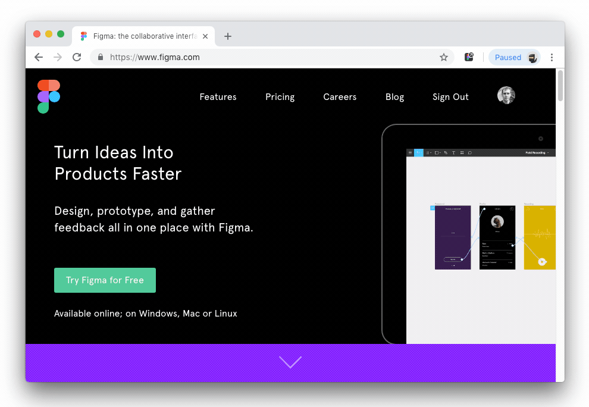

Open in Figma - Chrome Extension
======================

### This Chrome extension intercepts Figma shared links and redirects them to the [Figma desktop app](https://www.figma.com/downloads/).   

* [Official Website](https://www.fabriziorinaldi.io/openinfigma/)
* [Chrome Web Store](https://chrome.google.com/webstore/detail/open-in-figma/ebalaiojkmmkimgpakabcblclljnoloh)
* [Say Hi on Twitter](https://www.twitter.com/linuz90)

## Preview

   

### Usage
1. Download and install [Figma desktop app](https://www.figma.com/downloads/).
2. [Install extension](https://chrome.google.com/webstore/detail/open-in-figma/ebalaiojkmmkimgpakabcblclljnoloh) from Chrome Web Store.

### To install it manually:

1. Launch Chrome
2. Go to Extensions (`chrome://extensions/`)
3. Toggle `Developer mode`
4. Click `Load unpacked extension`
5. Select `src` folder from this repository

### Release notes 

| Version | Notes | Authors |
| --- | --- | --- |
| v.1.0 | Added option page, help file. Fixed issues. | [Sergey Osokin](https://github.com/creold) |
| v.0.3 | Now you can turn ON / OFF the extension by clicking on the icon | [Sergey Osokin](https://github.com/creold) |
| v.0.2 | After opening shared link in Figma desktop, the Chrome tab closes automatically. | [Sergey Osokin](https://github.com/creold) |
| v.0.1 | Initial Version. | [Fabrizio Rinaldi](https://www.fabriziorinaldi.io/) |

### Contribute

Found a bug? Please submit a new issues on GitHub.