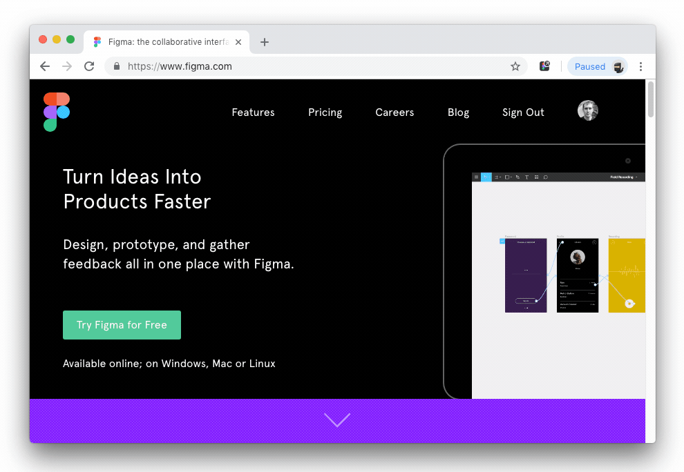
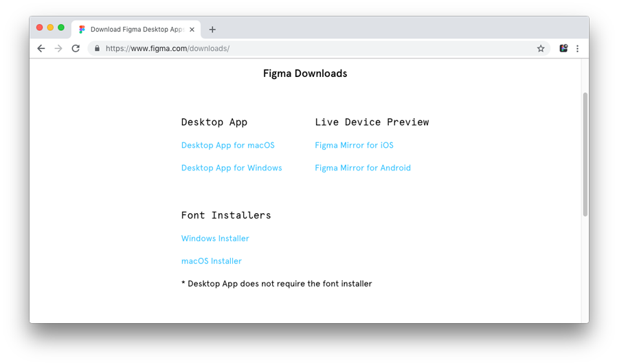
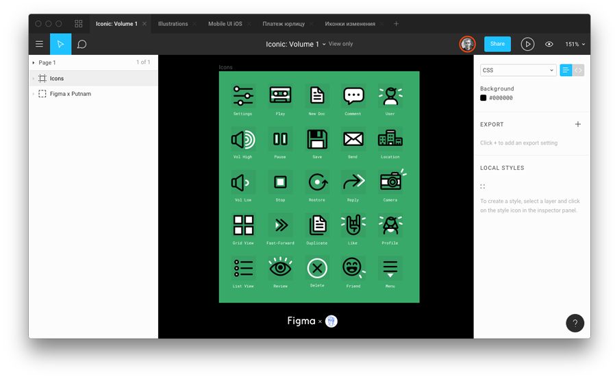
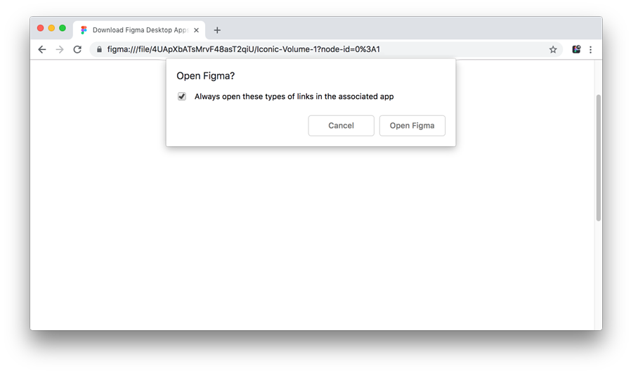
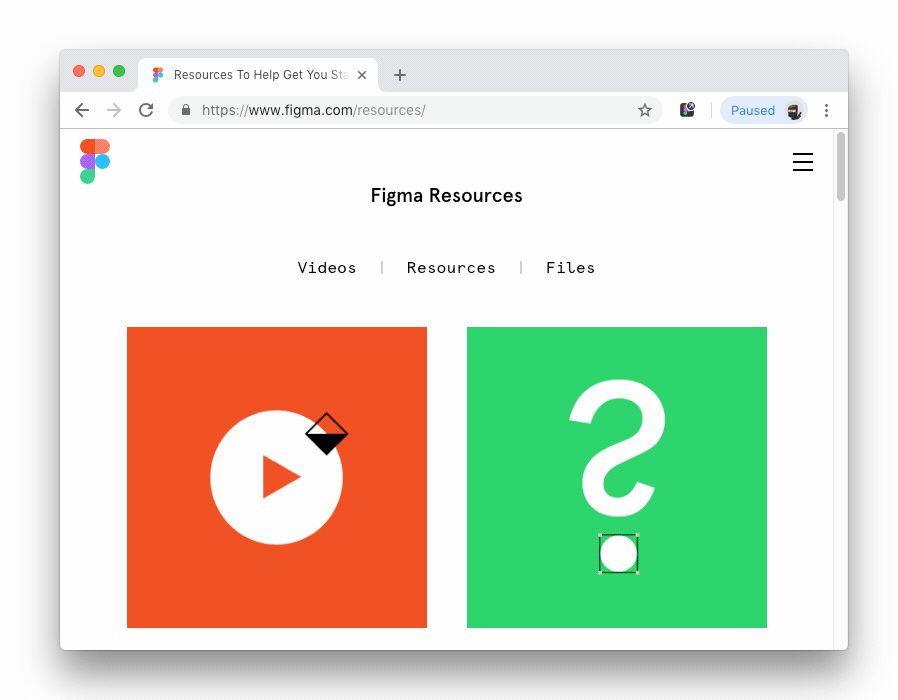
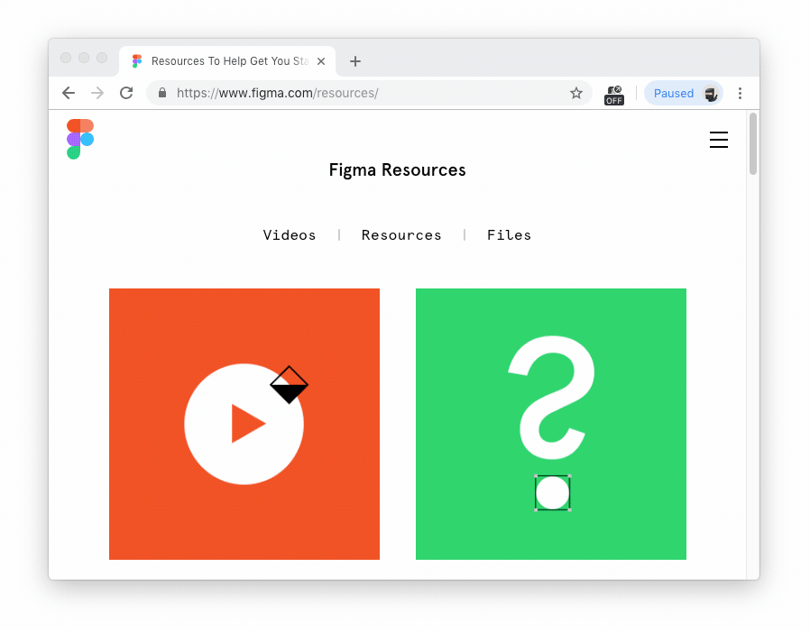

Open in Figma. Setup
======================

## How it works

## Step 1
Check whether you have Figma desktop app installed. If not, install it from the **[official site](https://www.figma.com/downloads/)**.

## Step 2

To check whether Figma links associated with the desktop app, click the demo link **[Iconic Icon Set by Ryan Putnam](http://www.figma.com/file/4UApXbATsMrvF48asT2qiU/Iconic-Volume-1?node-id=0%3A1)**.

## Step 3

If Figma opened, skip all the next steps. The extension is ready for use. 👍

## Step 4

If Figma didn't appear and you see a confirmation dialog in Chrome, select "Always open these links associated with this app" option and then click "Open Figma" button.

## Step 5

If Figma opened now, then the extension is ready for use. 👍

## Custom option

If you need to open a shared link in Chrome tab instead of Figma desktop app, you can switch the extension off by clicking on the extension icon.

Right-clicking on the extension icon shows you preferences popup.   
* Auto-close tabs in Chrome after opening a shared link in the Figma app.   
* Types of shared links to open in Figma app.

### Contribute

Found a bug? Please submit new issues on GitHub.